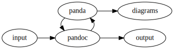
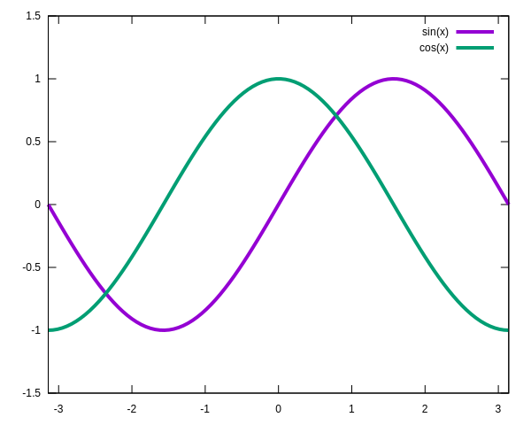

# LuaX and Pandoc based tools

`makex.mk` is a Makefile. It is intended to be included in any Makefile
to easily install some tools based on LuaX and Pandoc to pre-process
files and generate documents, using Lua as a common, simple and powerful
scripting language.

# Introduction

Lots of software projects involve various tools, free as well as
commercial, to build the software, run the tests, produce the
documentation, … These tools use different data formats and scripting
languages, which makes the projects less scalable and harder to
maintain.

Sharing data between configuration files, documentations, tests results
can then be painful and counter productive (the necessary glue is often
more complex than the tools themselves).

Usually people script their build systems and processes with languages
like Bash, Python, Javascript and make them communicate with plain text,
YAML, JSON, XML, CSV, INI, TOML. Every script shall rely on specific
(existing or not) libraries to read and write these data formats.

This document presents a commun and powerful data format and some tools
to script the build process of a project and generate documentation.

To sum up the suggested solution is:

- a **single data format**
- and a **reduced set of highly configurable tools**.

# Installation

Only `makex.mk` is required. Other files from the makex repository are
documentation and examples.

Just download `makex.mk` to a directory where other Makefiles can
include it:

``` sh
wget https://raw.githubusercontent.com/CDSoft/makex/master/makex.mk
```

or

``` sh
curl -O https://raw.githubusercontent.com/CDSoft/makex/master/makex.mk
```

The full repository is available on Github:
<https://github.com/CDSoft/makex>.

# Usage

`makex.mk` usage is pretty simple:

1.  include `makex.mk` in another Makefile
2.  use `$(LUAX)`, `$(YPP)`, `$(PANDOC_HTML)`, `$(PANDOC_PDF)`, … to
    call `luax`, `ypp`, `pandoc` (to generate HTML or PDF files)

For a complete documentation, please refer to `makex`:

``` makefile
# makex defines some make variable that can be used to execute makex tools:
#
# LUAX
#     path to the LuaX interpreter (see https://github.com/CDSoft/luax)
# YPP, YPP_LUA, YPP_LUAX, YPP_PANDOC
#     path to the ypp executables (see https://github.com/CDSoft/ypp)
# UPP
#     path to the upp executable (see https://github.com/CDSoft/upp)
# PANDA
#     path to the panda script (see https://github.com/CDSoft/panda)
# PANDOC
#     path to the pandoc executable (see https://pandoc.org)
# LATEX_TEMPLATE
#     path to a LaTeX template
#     (see https://github.com/Wandmalfarbe/pandoc-latex-template.git)
# LETTER
#     path to a LaTeX template
#     (see https://github.com/aaronwolen/pandoc-letter.git)
# PANAM_CSS
#     path to a CSS file (see https://benjam.info/panam)
# PANDOC_MD, PANDA_MD
#     shortcut to pandoc/panda with some default parameters
#     to generate Markdown documents
# PANDOC_GFM, PANDA_GFM
#     shortcut to pandoc/panda with some default parameters
#     to generate Github Markdown documents
# PANDOC_HTML, PANDA_HTML
#     shortcut to pandoc/panda with some default parameters
#     to generate HTML documents
# PANDOC_PDF, PANDA_PDF
#     shortcut to pandoc/panda with some default parameters
#     to generate PDF documents
# PANDOC_BEAMER, PANDA_BEAMER
#     shortcut to pandoc/panda with some default parameters
#     to generate beamer slideshows
# PANDOC_LETTER, PANDA_LETTER
#     shortcut to pandoc/panda with some default parameters
#     to generate a letter
# LSVG
#     path to the lsvg executable (see https://github.com/CDSoft/lsvg)
# PLANTUML
#     path to plantuml.jar
# DITAA
#     path to ditaa.jar
# MERMAID
#     path to mmdc (Mermaid)
# GHCUP, GHC, CABAL, STACK
#     path to the ghcup, ghc, cabal, stack executables
#     (see https://www.haskell.org/ghcup/)
# GHC_CMD, CABAL_CMD, STACK_CMD
#     ghc, cabal and stack commands executed through ghcup
#
# It also adds some targets:
#
# makex-clean
#     remove all makex tools
# makex-install
#     install all makex tools
# makex-install-luax
#     install luax
# makex-install-ypp
#     install ypp
# makex-install-upp
#     install upp
# makex-install-pandoc
#     install pandoc
# makex-install-panda
#     install panda
# makex-install-plantuml
#     install PlantUML
# makex-install-ditaa
#     install ditaa
# makex-install-mermaid
#     install mermaid
# makex-install-lsvg
#     install lsvg
# makex-install-ghcup
#     install ghcup
# help
#     runs the `welcome` target (user defined)
#     and lists the targets with their documentation

# The project configuration variables can be defined before including
# makex.mk.
#
# Makex update:
# wget http://cdelord.fr/makex/makex.mk

# MAKEX_INSTALL_PATH defines the path where tools are installed
MAKEX_INSTALL_PATH ?= /var/tmp/makex

# MAKEX_CACHE is the path where makex tools sources are stored and built
MAKEX_CACHE ?= $(MAKEX_INSTALL_PATH)/cache

# MAKEX_HELP_TARGET_MAX_LEN is the maximal size of target names
# used to format the help message
MAKEX_HELP_TARGET_MAX_LEN ?= 20

# LUAX_VERSION is a tag or branch name in the LuaX repository
LUAX_VERSION ?= master

# YPP_VERSION is a tag or branch name in the ypp repository
YPP_VERSION ?= master

# UPP_VERSION is a tag or branch name in the upp repository
UPP_VERSION ?= master

# PANDOC_VERSION is the version number of pandoc
PANDOC_VERSION ?= 3.1.2

# PANDOC_CLI_VERSION is the version number of pandoc-cli
PANDOC_CLI_VERSION ?= 0.1.1

# PANDOC_DYNAMIC_LINK is "no" to download a statically linked executable
# or "yes" to compile a dynamically linked executable with cabal
PANDOC_DYNAMIC_LINK ?= no

# PANDOC_LATEX_TEMPLATE_VERSION is a tag or branch name in the
# pandoc-latex-template repository
PANDOC_LATEX_TEMPLATE_VERSION ?= master

# PANDOC_LETTER_VERSION is a tag or branch name in the
# pandoc-letter repository
PANDOC_LETTER_VERSION ?= master

# PANAM_VERSION is a tag or branch name in the
# pan-am repository
PANAM_VERSION ?= master

# PANDA_VERSION is a tag or branch name in the Panda repository
PANDA_VERSION ?= master

# LSVG_VERSION is a tag or branch name in the lsvg repository
LSVG_VERSION ?= master

# GHCUP_INSTALL_BASE_PREFIX is the base of ghcup
GHCUP_INSTALL_BASE_PREFIX ?= $(MAKEX_INSTALL_PATH)/haskell

# HASKELL_GHC_VERSION is the ghc version to install
HASKELL_GHC_VERSION ?= recommended

# HASKELL_CABAL_VERSION is the cabal version to install
HASKELL_CABAL_VERSION ?= recommended

# RUSTUP_HOME is the rustup installation path
RUSTUP_HOME ?= $(MAKEX_INSTALL_PATH)/rustup

# CARGO_HOME is the cargo installation path
CARGO_HOME ?= $(MAKEX_INSTALL_PATH)/cargo

# TYPST_COMPILATION is "no" to download a precompiled executable
# or "yes" to compile typst with cargo
TYPST_COMPILATION ?= no

# TYPST_VERSION is a tag or branch name in the
# typst repository
TYPST_VERSION ?= v0.4.0

# PLANTUML_VERSION is the PlantUML version to install
PLANTUML_VERSION = 1.2023.8

# DITAA_VERSION is the ditaa version to install
DITAA_VERSION = 0.11.0
```

# Example

The Makefile used to generate this document is a pretty self-explanatory
example:

``` makefile
BUILD = .build
DEPENDENCIES = $(BUILD)/deps

HTML_OPTS += --table-of-content
HTML_OPTS += --mathml

PDF_OPTS += --table-of-content
PDF_OPTS += --highlight-style tango

## Generates README.md and examples
all: ../README.md
all: $(BUILD)/makex.html
all: $(BUILD)/makex.pdf
all: $(BUILD)/letter.pdf

# first include makex.mk to add makex targets ($(LUAX), $(UPP), ...)
include ../makex.mk
UPP_COLOR = ${BLACK}${BG_GREEN}
PANDA_COLOR = ${BLACK}${BG_GREEN}

# Note that comments starting with `##` are used by the `help` target
# to document targets (try `make help`)

## Clean the build directory
clean:
	rm -rf $(BUILD)

## Clean the build directory and all makex tools
mrproper: clean makex-clean

.SECONDARY:

# This is the welcome message used by the `help` target.
# Note the single `#`, this is not a documentation for `help`.
welcome:
	@echo '${TEXT_COLOR}makex${NORMAL} usage example'

# Preprocess a Markdown file with $(UPP).
# The preprocessed file is also a Markdown file
# that can be used by $(PANDA).
$(BUILD)/%.md: %.md makex.lua | $(UPP) $(DEPENDENCIES)
	@echo '${UPP_COLOR}[UPP]${NORMAL} ${TARGET_COLOR}$< -> $@${NORMAL}'
	@mkdir -p $(dir $@)
	@$(UPP) -MT $@ -MF $(DEPENDENCIES)/$(notdir $@).upp.d \
		-p . -l makex.lua $< -o $@

# Render an HTML file using $(PANDA) (i.e. pandoc and some Lua filters)
$(BUILD)/%.html: $(BUILD)/%.md | $(PANDA) $(PANAM_CSS) img $(DEPENDENCIES)
	@echo '${PANDA_COLOR}[PANDA]${NORMAL} ${TARGET_COLOR}$< -> $@${NORMAL}'
	@PANDA_TARGET=$@ \
	PANDA_DEP_FILE=$(DEPENDENCIES)/$(notdir $@).panda.d \
	$(PANDA_HTML) $(HTML_OPTS) $< -o $@

# Render a PDF file using $(PANDA) (i.e. pandoc and some Lua filters)
$(BUILD)/%.pdf: $(BUILD)/%.md | $(PANDA) $(LATEX_TEMPLATE) img $(DEPENDENCIES)
	@echo '${PANDA_COLOR}[PANDA]${NORMAL} ${TARGET_COLOR}$< -> $@${NORMAL}'
	@PANDA_TARGET=$@ \
	PANDA_DEP_FILE=$(DEPENDENCIES)/$(notdir $@).panda.d \
	$(PANDA_PDF) $(PDF_OPTS) $< -o $@

# Render an english letter using $(PANDA) (i.e. pandoc and some Lua filters)
$(BUILD)/letter.pdf: $(BUILD)/letter.md | $(PANDA) $(LETTER) img $(DEPENDENCIES)
	@echo '${PANDA_COLOR}[PANDA]${NORMAL} ${TARGET_COLOR}$< -> $@${NORMAL}'
	@PANDA_TARGET=$@ \
	PANDA_DEP_FILE=$(DEPENDENCIES)/$(notdir $@).panda.d \
	LANG=en \
	$(LETTER) $< -o $@

$(BUILD)/letter.md: $(MAKEX_CACHE)/pandoc-letter/example/letter.md | $(PANDA)
	@echo '${PANDA_COLOR}[CP]${NORMAL} ${TARGET_COLOR}$< -> $@${NORMAL}'
	@cp $< $@
	@sed -i 's#example/#$(dir $<)#' $@

$(MAKEX_CACHE)/pandoc-letter/example/letter.md: $(LETTER)

# Render a Github Markdown file using $(PANDA)
../README.md: $(BUILD)/makex.md fix_links.lua | $(PANDA) img $(DEPENDENCIES)
	@echo '${PANDA_COLOR}[PANDA]${NORMAL} ${TARGET_COLOR}$< -> $@${NORMAL}'
	@PANDA_TARGET=$@ \
	PANDA_DEP_FILE=$(DEPENDENCIES)/$(notdir $@).panda.d \
	$(PANDA_GFM) -L fix_links.lua $< -o $@

img $(DEPENDENCIES):
	@mkdir -p $@

-include $(wildcard $(DEPENDENCIES)/*.d)
```

# Lua[^1]

[Lua](https://www.lua.org) is the perfect candidate for both a common
data format and a script language.

## What is Lua?

Lua is a powerful, efficient, lightweight, embeddable scripting
language. It supports procedural programming, object-oriented
programming, functional programming, data-driven programming, and data
description.

Lua combines simple procedural syntax with powerful data description
constructs based on associative arrays and extensible semantics. Lua is
dynamically typed, runs by interpreting bytecode with a register-based
virtual machine, and has automatic memory management with incremental
garbage collection, making it ideal for configuration, scripting, and
rapid prototyping.

## Why choose Lua?

**Lua is a proven, robust language**

Lua has been used in many industrial applications (e.g., Adobe’s
Photoshop Lightroom), with an emphasis on embedded systems (e.g., the
Ginga middleware for digital TV in Brazil) and games (e.g., World of
Warcraft and Angry Birds). Lua is currently the leading scripting
language in games. Lua has a solid reference manual and there are
several books about it. Several versions of Lua have been released and
used in real applications since its creation in 1993. Lua featured in
HOPL III, the Third ACM SIGPLAN History of Programming Languages
Conference, in 2007. Lua won the Front Line Award 2011 from the Game
Developers Magazine.

**Lua is fast**

Lua has a deserved reputation for performance. To claim to be “as fast
as Lua” is an aspiration of other scripting languages. Several
benchmarks show Lua as the fastest language in the realm of interpreted
scripting languages. Lua is fast not only in fine-tuned benchmark
programs, but in real life too. Substantial fractions of large
applications have been written in Lua.

**Lua is portable**

Lua is distributed in a small package and builds out-of-the-box in all
platforms that have a standard C compiler. Lua runs on all flavors of
Unix and Windows, on mobile devices (running Android, iOS, BREW,
Symbian, Windows Phone), on embedded microprocessors (such as ARM and
Rabbit, for applications like Lego MindStorms), on IBM mainframes, etc.

**Lua is powerful (but simple)**

A fundamental concept in the design of Lua is to provide meta-mechanisms
for implementing features, instead of providing a host of features
directly in the language. For example, although Lua is not a pure
object-oriented language, it does provide meta-mechanisms for
implementing classes and inheritance. Lua’s meta-mechanisms bring an
economy of concepts and keep the language small, while allowing the
semantics to be extended in unconventional ways.

**Lua is small**

Adding Lua to an application does not bloat it. The tarball for Lua
5.4.4, which contains source code and documentation, takes 353K
compressed and 1.3M uncompressed. The source contains around 30000 lines
of C. Under 64-bit Linux, the Lua interpreter built with all standard
Lua libraries takes 281K and the Lua library takes 468K.

**Lua is free**

Lua is free open-source software, distributed under a very liberal
license (the well-known MIT license). It may be used for any purpose,
including commercial purposes, at absolutely no cost. Just download it
and use it.

# LuaX

[LuaX](https://github.com/CDSoft/luax) is a Lua interpretor and REPL
based on Lua 5.4.4, augmented with some useful packages. LuaX can also
produce standalone executables from Lua scripts.

LuaX runs on several platforms with no dependency:

- Linux (x86_64, i386, aarch64)
- MacOS (x86_64, aarch64)
- Windows (x86_64, i386)

LuaX can cross-compile scripts from and to any of these platforms.

LuaX comes with a standard Lua interpretor and provides some libraries
(embedded in a single executable, no external dependency required):

- [LuaX interactive
  usage](https://github.com/CDSoft/luax/blob/master/doc/repl.md):
  improved Lua REPL
- [fun](https://github.com/CDSoft/luax/blob/master/doc/fun.md):
  functional programming inspired functions
- [fs](https://github.com/CDSoft/luax/blob/master/doc/fs.md): file
  system management
- [sh](https://github.com/CDSoft/luax/blob/master/doc/sh.md): shell
  command execution
- [mathx](https://github.com/CDSoft/luax/blob/master/doc/mathx.md):
  complete math library for Lua
- [imath](https://github.com/CDSoft/luax/blob/master/doc/imath.md):
  arbitrary precision integer and rational arithmetic library
- [qmath](https://github.com/CDSoft/luax/blob/master/doc/qmath.md):
  rational number library
- [complex](https://github.com/CDSoft/luax/blob/master/doc/complex.md):
  math library for complex numbers based on C99
- [ps](https://github.com/CDSoft/luax/blob/master/doc/ps.md): Process
  management module
- [sys](https://github.com/CDSoft/luax/blob/master/doc/sys.md): System
  module
- [crypt](https://github.com/CDSoft/luax/blob/master/doc/crypt.md):
  cryptography module
- [lz4](https://github.com/CDSoft/luax/blob/master/doc/lz4.md):
  Extremely Fast Compression algorithm
- [lpeg](https://github.com/CDSoft/luax/blob/master/doc/lpeg.md):
  Parsing Expression Grammars For Lua
- [linenoise](https://github.com/CDSoft/luax/blob/master/doc/linenoise.md):
  light readline alternative
- [luasocket](https://github.com/CDSoft/luax/blob/master/doc/luasocket.md):
  Network support for the Lua language
- [inspect](https://github.com/CDSoft/luax/blob/master/doc/inspect.md):
  Human-readable representation of Lua tables

More information here: <http://cdelord.fr/luax>

# Scripting with LuaX

LuaX can be used as a general programming language. There are plenty of
[good documentations for Lua](https://www.lua.org/docs.html) and
[LuaX](http://cdelord.fr/luax).

A big advantage of Lua is the usage of Lua tables as a common data
format usable by various tools. It is Human-readable and structured. It
can be generated by Lua scripts but also by any software producing text
files.

Typical usages are:

- project/software configuration
  - a Lua table can be used to describe a project or a software
    configuration
    - read by an embedded Lua interpretor
    - used to generate documentation or source code
- tests results
  - a test suite can generate test results as a Lua table
  - tests results can be used to render documentation (tests reports)
    and compute a test coverage

The next chapters present some tools written in Lua/LuaX or using Lua as
a scripting engine.

# UPP

UPP is a minimalist and generic text preprocessor using Lua macros.

UPP is compiled by LuaX, i.e. Lua and LuaX functions and modules are
available in macros.

More information here: <http://cdelord.fr/upp>

UPP is pretty simple. It searches for Lua expressions and replaces
macros with their results.

| Macro                 | Result                                                                           |
|:----------------------|:---------------------------------------------------------------------------------|
| `$(...)` or `@(...)`  | Evaluates the Lua expression `...` and replaces the macro by its result          |
| `:(...)` or `@@(...)` | Executes the Lua chunk `...` and replaces the macro by its result (if not `nil`) |

## Example

``` markdown
$$
\sum_{i=1}^{100} i^2 = @(F.range(100):map(function(x) return x*x end):sum())
$$
```

is rendered as

> $$
> \sum_{i=1}^{100} i^2 = 338350
> $$

Macros can also define variables reusable later by other macros.

``` markdown
@@( local foo = 42
    N = foo * 23 + 34
    local function sq(x) return x*x end
    function sumsq(n) return F.range(N):map(sq):sum() end
)
```

defines `N` ($N = 1000$) which can be read in a Lua expression or with
`@(N)` and `sumsq` which computes the sum of squares.

Then

``` markdown
$$
\sum_{i=1}^{@(N)} i^2 = @(sumsq(N))
$$
```

becomes

> $$
> \sum_{i=1}^{1000} i^2 = 333833500
> $$

# Pandoc

[Pandoc](https://pandoc.org/) is a swiss-army knife to convert from and
to a bunch of document formats.

A big advantage of Pandoc is the ability to use Lua scripts to define
custom readers and writers for unsupported formats and also Lua filters
to manipulate the pandoc abstract syntax tree (AST). This is the main
pandoc feature exercised in this document.

Pandoc has an excellent documentation:

- main pandoc documentation: <https://pandoc.org/MANUAL.html>
- Lua filter documentation: <https://pandoc.org/lua-filters.html>

This document uses pandoc Lua filters with Panda (see next chapter)
which bundles some useful filters in a single script.

# Panda

Panda is a [Pandoc Lua filter](https://pandoc.org/lua-filters.html) that
works on internal Pandoc’s AST.

It provides several interesting features:

- variable expansion (minimalistic templating)
- conditional blocks
- file inclusion (e.g. for source code examples)
- script execution (e.g. to include the result of a command)
- diagrams (Graphviz, PlantUML, ditaa, Asymptote, blockdiag, mermaid…)

The documentation of Panda is here: <http://cdelord.fr/panda>

## Examples

There are lots of examples in the documentation of panda. We will see
here two of them.

**Documentation extraction from source code**

The source code can be documented by adding special marks in comments.
The documentation shall be written in Markdown. The default mark is
`@@@` and can be customized.

For instance, the following C source contains documentation that can be
extracted and included to a Pandoc document.

```` c
/*@@@
**`answer`** takes any question and returns the most relevant answer.

Example:

``` c
    const char *meaning = answer("What's the meaning of life?");
```
@@@*/

#include <unistd.h>

const char *answer(const char *question)
{
    /* Test all the possibilities */
    for (int y = 0; y < 7500000; y++)
    {
        sleep(365 * 86400);
    }
    /* Returns the most relevant answer */
    return "42";
}
````

To extract the documentation, panda provides a macro to replace a `div`
element by the documentation chunks from a file. E.g.:

``` markdown
:::{doc="deep_thought.c"}
:::
```

will be replaced by:

> **`answer`** takes any question and returns the most relevant answer.
>
> Example:
>
> ``` c
>     const char *meaning = answer("What's the meaning of life?");
> ```

**Diagrams**

Diagrams can be embedded in Pandoc documents. Diagrams are specified as
code blocks and are replaced by an image by panda.

    ```{.dot render="{{dot}}" width=67%}
    digraph {
        rankdir=LR;
        input -> pandoc -> output
        pandoc -> panda -> {pandoc, diagrams}
        { rank=same; pandoc, panda }
        { rank=same; diagrams, output }
    }
    ```



    ```{render="{{gnuplot}}" width=67%}
    set xrange [-pi:pi]
    set yrange [-1.5:1.5]
    plot sin(x) lw 4, cos(x) lw 4
    ```



# Haskell

[Haskell](https://www.haskell.org/) is a general-purpose,
statically-typed, purely functional programming language with type
inference and lazy evaluation.

Haskell related tools are installed with GHCup.

## GHCup

[GHCup](https://www.haskell.org/ghcup/) is the main installer for the
general purpose language Haskell.

## GHC

[GHC](https://www.haskell.org/ghc/) is a state-of-the-art, open source,
compiler and interactive environment for the functional language
Haskell.

## Cabal

[Cabal](https://www.haskell.org/cabal/) is a system for building and
packaging Haskell libraries and programs. It defines a common interface
for package authors and distributors to easily build their applications
in a portable way. Cabal is part of a larger infrastructure for
distributing, organizing, and cataloging Haskell libraries and programs.

## Stack

Stack is a program for developing Haskell projects. It is aimed at
Haskellers both new and experienced. It is cross-platform and aims to
support fully users on Linux, macOS and Windows.

Stack features:

- Installing the [Glasgow Haskell Compiler
  (GHC)](https://www.haskell.org/ghc/) automatically, in an isolated
  location.
- Installing packages needed for your project.
- Building your project.
- Testing your project.
- Benchmarking your project.

The documentation of Stack is here:
<https://docs.haskellstack.org/en/stable/>

# References

[**makex repository**](https://github.com/CDSoft/makex):
<https://github.com/CDSoft/makex>

[**Lua**](https://www.lua.org): <https://www.lua.org>

> Lua is a powerful, efficient, lightweight, embeddable scripting
> language. It supports procedural programming, object-oriented
> programming, functional programming, data-driven programming, and data
> description.

[**Lua documentation**](https://www.lua.org/manual/5.4/):
<https://www.lua.org/manual/5.4/>

> The reference manual is the official definition of the Lua language.

[**LuaX**](https://github.com/CDSoft/luax):
<https://github.com/CDSoft/luax>

> LuaX is a Lua interpretor and REPL based on Lua 5.4.4, augmented with
> some useful packages. LuaX can also produce standalone executables
> from Lua scripts.

[**UPP**](https://github.com/CDSoft/upp):
<https://github.com/CDSoft/upp>

> UPP is a minimalist and generic text preprocessor using Lua macros.

[**Pandoc**](https://pandoc.org): <https://pandoc.org>

> Pandoc is a universal document converter. If you need to convert files
> from one markup format into another, pandoc is your swiss-army knife.

[**Pandoc manual**](https://pandoc.org/MANUAL.html):
<https://pandoc.org/MANUAL.html>

> Pandoc User’s Guide

[**Pandoc’s
Markdown**](https://pandoc.org/MANUAL.html#pandocs-markdown):
<https://pandoc.org/MANUAL.html#pandocs-markdown>

> Pandoc understands an extended and slightly revised version of John
> Gruber’s Markdown syntax. This document explains the syntax, noting
> differences from original Markdown.

[**Pandoc Lua filters**](https://pandoc.org/lua-filters.html):
<https://pandoc.org/lua-filters.html>

> Pandoc has long supported filters, which allow the pandoc abstract
> syntax tree (AST) to be manipulated between the parsing and the
> writing phase. Traditional pandoc filters accept a JSON representation
> of the pandoc AST and produce an altered JSON representation of the
> AST. They may be written in any programming language, and invoked from
> pandoc using the `--filter` option.
>
> Although traditional filters are very flexible, they have a couple of
> disadvantages. First, there is some overhead in writing JSON to stdout
> and reading it from stdin (twice, once on each side of the filter).
> Second, whether a filter will work will depend on details of the
> user’s environment. A filter may require an interpreter for a certain
> programming language to be available, as well as a library for
> manipulating the pandoc AST in JSON form. One cannot simply provide a
> filter that can be used by anyone who has a certain version of the
> pandoc executable.
>
> Starting with version 2.0, pandoc makes it possible to write filters
> in Lua without any external dependencies at all. A Lua interpreter
> (version 5.3) and a Lua library for creating pandoc filters is built
> into the pandoc executable. Pandoc data types are marshaled to Lua
> directly, avoiding the overhead of writing JSON to stdout and reading
> it from stdin.

[**Panda**](https://github.com/CDSoft/panda):
<https://github.com/CDSoft/panda>

> Panda is a Pandoc Lua filter that works on internal Pandoc’s AST.

[^1]: from <https://www.lua.org/about.html>
